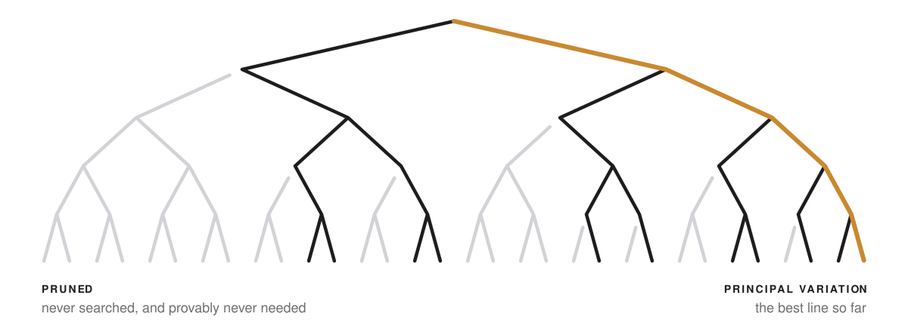
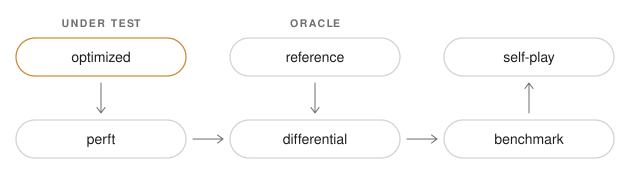

<p align="center">
  <picture>
    <source media="(prefers-color-scheme: dark)" srcset="assets/img/mark-dark.svg">
    
  </picture>
</p>

<h1 align="center">ScacchiForge</h1>

<p align="center">
  A chess engine that decides by removing work,<br>
  and never mistakes a heuristic for a theorem.
</p>

<p align="center">
  <a href="LICENSE"></a>
  <a href="docs/adr/0001-common-lisp-sbcl.md"></a>
  <a href="https://www.sbcl.org/"></a>
  <a href="docs/adr/0004-nessuna-dipendenza-esterna-e-harness-proprio.md"></a>
  <a href="docs/roadmap.md"></a>
</p>

<p align="center">
  <a href="#the-idea">Idea</a> ·
  <a href="#how-it-works">How it works</a> ·
  <a href="#classification">Classification</a> ·
  <a href="#verification">Verification</a> ·
  <a href="#status">Status</a> ·
  <a href="#quick-start">Quick start</a> ·
  <a href="docs/README.md">Documentation</a>
</p>

<br>

<p align="center">
  <picture>
    <source media="(prefers-color-scheme: dark)" srcset="assets/img/hero-dark.svg">
    
  </picture>
</p>

## The idea

<table>
  <tr>
    <td width="33%" valign="top">
      <strong>Remove work, do not add speed.</strong><br><br>
      The aim is the number of operations needed for a strong decision, not
      operations per second. Nodes per second is the last metric on the list.
    </td>
    <td width="33%" valign="top">
      <strong>Nothing unverified is accepted.</strong><br><br>
      A simple reference model is the oracle. The optimized engine must agree
      with it, and perft must pass before aggressive search is introduced.
    </td>
    <td width="33%" valign="top">
      <strong>Every shortcut carries a tag.</strong><br><br>
      Each reduction of work is marked as a theorem, exact, bounded,
      probabilistic, heuristic, empirical or learned. A heuristic is never
      presented as a theorem.
    </td>
  </tr>
</table>

The usual question is how many nodes per second an engine can search. ScacchiForge asks how
few nodes a strong decision needs, and what each shortcut costs in correctness.

It is an original engine in Common Lisp (SBCL), meant as a platform on which search algorithms,
heuristics and learned models compete, and on which the work each one removes is measured. The
specification forbids code from Stockfish, code derived from it, and proprietary engines. It
is not a playable engine yet: there is no game loop and no UCI. See [Status](#status).

## How it works

<p align="center">
  <picture>
    <source media="(prefers-color-scheme: dark)" srcset="assets/img/flow-dark.svg">
    
  </picture>
</p>

The picture is the process the project requires of every change. It does not say that a gate
passes. Today the OPTIMIZED side has a move generator, a classical evaluation, baseline searches
and the searches of Phase 3 (a transposition table, move ordering, PVS and NegaScout) of its own,
and two gates judge them: perft, against the same expected counts as the reference, and the
differential test, against the reference itself, which now compares the evaluation term by term
and the value of a search at fixed depth. The benchmark gate has microbenchmarks, perft rows and
three groups of rows of an engine benchmark: search nodes per CPU second at fixed depth, on five
positions; the cost of one evaluation call, measured three ways; and the searches of Phase 3,
with and without ordering and transposition table, with the ordering's efficiency, the table's
hit rate and the cost of a lookup. There is no self-play: there is no game loop, and no game has
been played. What runs where is under [Verification](#verification).

```
src/
├── core/        definitions shared by both levels: squares, pieces, packed moves,
│                a seeded random generator, Zobrist key tables
├── reference/   the oracle, simple on purpose, on a flat board vector: FEN, legal move
│                generation, make/unmake, perft, checkmate and stalemate, the material
│                evaluation and the classical one, recomputed on every call, the colour
│                swap of a position, negamax, alpha-beta and iterative deepening with
│                their principal variation, a legal-position fuzzer
└── optimized/   bitboards: a position that converts to and from the reference's, attack
                 tables, slider attacks (magic bitboards or rays), make/unmake with an
                 incremental key, pseudo-legal generation, a legality filter by check and
                 pin masks, perft; the classical evaluation, with material, piece-square
                 tables and game phase kept incrementally by make/unmake; the colour swap;
                 negamax, alpha-beta and iterative deepening at fixed depth, with a
                 preallocated context; a transposition table with a verification mode, a
                 move ordering, PVS and NegaScout with PV, Cut and All node types counted.
                 No quiescence, killer moves, history or pruning beyond alpha-beta
```

The reference never depends on the optimized level. The optimized level uses the reference
only to convert a position to and from its own structure: moves, attacks, make/unmake, keys,
the evaluation with its parameters and tables, and the search it computes itself, so that the
comparison judges them. `core` holds definitions only, because a mistake shared by both levels
is invisible to a comparison between them. These rules are decided
([ADR-0010](docs/adr/0010-regole-di-indipendenza-tra-i-livelli.md)), described in
[architettura.md](docs/architettura.md#regole-tra-i-livelli). The design of the optimized level
is recorded in four more accepted records and three proposals, listed under
[Decisions](#decisions). The seven separations the specification itself asks for are in
[the same document](docs/architettura.md#sette-separazioni).

## Classification

The specification requires every reduction of work to carry at least one tag. The seven tags and
their meanings are the specification's.

| Tag | Meaning |
|---|---|
| `[THEOREM]` | Provable correctness. |
| `[EXACT]` | An exact algorithm, with no loss of correctness. |
| `[BOUNDED]` | Produces mathematically interpretable bounds. |
| `[PROBABILISTIC]` | Practical correctness resting on explicit probabilistic properties. |
| `[HEURISTIC]` | A heuristic with no general guarantee. |
| `[EMPIRICAL]` | Validated by experiment. |
| `[LEARNED]` | Parameters or functions obtained by training. |

Two working rules come from the repository and were accepted by the author
([ADR-0011](docs/adr/0011-convenzioni-di-classificazione.md)): when in doubt, the weaker tag, and
a combination is only as strong as its weakest part. The tag proposed for every technique the
specification names, and the format for docstrings and commits, are in
[classificazione.md](docs/classificazione.md). That table is still a proposal: a row binds only
when an accepted record decides it. Seven rows carry a decision so far, two of them only in
part: the two Zobrist rows (0005); legal generation and make/unmake, decided for the optimized
level, the attack tables, decided for its precomputed tables and not for PEXT, and the legality
filter by masks (0015); the magic bitboards of the optimized level (0016); native microkernels
(0001). The rows of the transposition table, PVS and NegaScout and move ordering name the
proposals that apply them to the optimized level (0021 to 0023): they are not decided. No tool
checks that a tag is present; review does.

## Decisions

Twenty-three records so far: twenty accepted, three proposals. *Accepted*
means the record states the specification or the author's own choice. Six were accepted when
they were written (0001 to 0003, 0006 to 0008); the parts of them that were only proposals later
moved to 0010 to 0013. Ten were proposals of this repository until the author accepted them
all on 2026-10-04 (0004, 0005, 0009 to 0016). One, 0017, records a decision the author took that
day. Four, 0010 to 0013, hold the rules for applying an earlier record. Three, 0014 to 0016,
hold the design of the optimized level. Two, 0018 and 0019, hold the definition of the
classical evaluation of Phase 2 and how the optimized level implements it and searches; the
author accepted them on 2026-10-07, once the pawn-structure weights were replaced by a written
rule, as decided for [QA-18](docs/limiti-e-rischi.md#qa-18). One, 0020, records the author's
decision that INV-X7 applies to the evaluation parameters from Phase 10. Three, 0021 to 0023,
are proposals of this repository for Phase 3, written with the code they describe; they bind
nothing until the author accepts them.

| Topic | Decision | Status | Record |
|---|---|---|---|
| Language | Common Lisp, SBCL as the primary implementation. Native kernels only under five conditions. | Accepted | [0001](docs/adr/0001-common-lisp-sbcl.md) |
| Oracle | The reference implementation is the oracle for the optimized engine. | Accepted | [0002](docs/adr/0002-implementazione-di-riferimento-come-oracolo.md) |
| Tags | Seven tags for every reduction of work. | Accepted | [0003](docs/adr/0003-classificazione-delle-riduzioni-di-lavoro.md) |
| Dependencies | None beyond SBCL and ASDF. A test harness of its own. | Accepted | [0004](docs/adr/0004-nessuna-dipendenza-esterna-e-harness-proprio.md) |
| Zobrist keys | Drawn from a deterministic generator, never from `sxhash`. | Accepted | [0005](docs/adr/0005-chiavi-zobrist-da-prng-deterministico.md) |
| Metrics | Elo per CPU-second first, nodes per second last. | Accepted | [0006](docs/adr/0006-gerarchia-delle-metriche.md) |
| License | BSD-2-Clause. Original code: no Stockfish, no derived code. | Accepted | [0007](docs/adr/0007-licenza-bsd-2-clause-e-originalita.md) |
| Perft | A mandatory gate. | Accepted | [0008](docs/adr/0008-perft-gate-obbligatorio.md) |
| Language of the docs | Documentation in Italian, code in English. | Accepted | [0009](docs/adr/0009-convenzione-linguistica.md) |
| Layer rules | How the reference and the optimized level stay independent, so that the comparison judges them. Applies 0002. | Accepted | [0010](docs/adr/0010-regole-di-indipendenza-tra-i-livelli.md) |
| Tag conventions | How tags combine, where they are written, and the tag proposed for each technique; a row of that table binds only when a record decides it. Applies 0003. | Accepted | [0011](docs/adr/0011-convenzioni-di-classificazione.md) |
| Reading of the perft gate | The gate of Phase 1 comes before any later phase of the optimized engine; the reference may hold simple search as an oracle; published and regression values. Applies 0008. | Accepted | [0012](docs/adr/0012-lettura-del-gate-di-perft.md) |
| Originality in practice | Published algorithms and ideas may be implemented; code, tuned tables, weights and training data of other engines may not; facts such as perft counts come with their source. Applies 0007. | Accepted | [0013](docs/adr/0013-interpretazione-operativa-dell-originalita.md) |
| Compilation policy | The hot path of the optimized level compiles at `speed 3`, `safety 1`, set in one place, so array bounds stay checked. A checked build at `safety 3` runs every suite. Allocation is a test. | Accepted | [0014](docs/adr/0014-policy-di-compilazione-del-livello-ottimizzato.md) |
| Optimized move generator | Bitboards; pseudo-legal generation, a legality filter and make/unmake as separate functions. Legality from check and pin masks, an algorithm other than the reference's. Stacked, preallocated move buffers. | Accepted | [0015](docs/adr/0015-generatore-di-mosse-del-livello-ottimizzato.md) |
| Slider attacks | Magic bitboards, with numbers this project searches from a fixed seed, beside classical rays. `SCF_SLIDERS` picks one at compile time. The default, `fixed-magic`, comes from a measurement on one machine; its research record, [EXP-0001](research/exp-0001-attacchi-dei-pezzi-a-lunga-gittata.md), is accepted under 0017. | Accepted | [0016](docs/adr/0016-attacchi-dei-pezzi-a-lunga-gittata.md) |
| Research path for exact alternatives | An alternative tagged `[EXACT]` whose outputs are identical to those of the existing implementation or of the reference, as an exhaustive or differential equivalence test and perft show, meets the research method on that proof, a microbenchmark and `make bench` with its environment record and a decision rule, run on a clean committed revision. Self-play and statistical validation do not apply. Anything that changes an output needs the whole method. Closes [QA-17](docs/limiti-e-rischi.md#qa-17). | Accepted | [0017](docs/adr/0017-percorso-di-ricerca-per-le-alternative-exact.md) |
| Classical evaluation | One exact integer definition of the nine terms the specification names, written in [valutazione.md](docs/valutazione.md) so that the reference and the optimized level can each implement it and give the same score: a game phase from the non-pawn material, a middlegame/endgame blend rounded toward zero so that swapping the colours negates the score exactly, the score from White's side returned from the side to move, material and piece-square tables kept incrementally in the optimized level. No weight is tuned by this repository: none is fitted to data, chosen by a recorded measurement or validated by an experiment here. Most follow from simple stated rules; the six pawn-structure weights are fixed by a written rule, one unit for each support a pawn lacks, chosen by the author to replace earlier weights of which five equalled constants of Fruit 2.1 ([QA-18](docs/limiti-e-rischi.md#qa-18)). The other known matches with published engines are listed in [valutazione.md](docs/valutazione.md#provenienza). Implemented in both levels. | Accepted | [0018](docs/adr/0018-definizione-della-valutazione-classica.md) |
| Optimized evaluation and search | The optimized level keeps its own copy of the evaluation parameters and builds its tables from the formulas; unmake reads the incremental state back from the undo stack. Negamax, alpha-beta and iterative deepening at fixed depth, with a preallocated context and a triangular table of principal variations. Compared with the reference: the value of a search and the node count of negamax, not the best move or alpha-beta's node count, which depend on the order of the moves. The first search signature, in `tests/search-signature.sexp`, written only by `make signatures`. States two departures from decided invariants: INV-X7, the parameters are code, settled by 0020 ([QA-19](docs/limiti-e-rischi.md#qa-19)), and INV-X3, the incremental state has its equivalence test but not the measurement 0017 asks for ([EXP-0002](research/exp-0002-stato-incrementale-della-valutazione.md)). | Accepted | [0019](docs/adr/0019-valutazione-e-ricerca-del-livello-ottimizzato.md) |
| Evaluation parameters | The evaluation parameters stay constants in the code of both levels until Phase 10, when tuning needs them as data; that phase's gate decides the form, measuring its cost. Until then a weight changes in one commit: the definition with its worked examples, both copies, the expected test values and the search signature. Closes [QA-19](docs/limiti-e-rischi.md#qa-19). | Accepted | [0020](docs/adr/0020-parametri-della-valutazione-dalla-fase-10.md) |
| Transposition table | The optimized level's own table: compact 16-byte entries in typed arrays, the full 64-bit key compared on every probe, size, replacement policy (always, depth-preferred, two slots per bucket) and mode as arguments. A verification mode for tests, never for play, meets TT-1 to TT-4: cutoffs only on entries of the node's depth, scores stored relative to the node, an independent check of the position in every slot, false hits discarded and counted. A move read from the table is used only if it is among the node's legal moves. Proposed defaults for [QA-01](docs/limiti-e-rischi.md#qa-01) and [QA-02](docs/limiti-e-rischi.md#qa-02) (no repetition or fifty-move rule in the search, so no stored score depends on the path), which stay open. | Proposed | [0021](docs/adr/0021-transposition-table-del-livello-ottimizzato.md) |
| PVS, NegaScout, node types | PVS and NegaScout as window schemes of a Phase 3 node beside the unchanged baselines; NegaScout re-searches from one below the null-window result and does not re-search a result that is already exact. PV, Cut and All node types expected before a node is searched and observed after, counted. The default search of Phase 3: iterative deepening of PVS with ordering and a table. The search signature, format 2, records the baseline alpha-beta and that default search with its table in verification mode. | Proposed | [0022](docs/adr/0022-pvs-negascout-e-tipi-di-nodo.md) |
| Move ordering | The TT move, the previous iteration's PV move, captures by most valuable victim and least valuable attacker, promotions, the rest; a stable insertion sort with no allocation. No killer moves, history or exchange evaluation (Phase 4). | Proposed | [0023](docs/adr/0023-ordinamento-delle-mosse-della-fase-3.md) |

The whole log is in [docs/adr/](docs/adr/README.md). What is not known yet is kept as sixteen
open questions in [limiti-e-rischi.md](docs/limiti-e-rischi.md#questioni-aperte), each with the
experiment or the decision (ADR) that would close it; three more stay listed there, closed:
QA-17 by 0017, QA-18 by the author's choice of a rule for the pawn-structure weights, QA-19 by
0020.

## Verification

The chain of trust has three links: published perft counts, where they exist, judge the
reference, and the reference judges the optimized engine. What exists today:

| | What it judges | Today |
|---|---|---|
| Perft | Move generation and make/unmake, by leaf count, against published values where they exist | Exists for both levels, which read their expected counts from the same tables. Seven well-known positions, and edge cases: pins, en passant, castling, promotion, discovered check. `make test` runs the standard depths and `make perft-deep` runs deeper ones, on both levels. For the six positions of the Chess Programming Wiki's *Perft Results* page, every count, the deep ones included, is the wiki's. The promotion position and its six counts, and the castling position with all four rights and its four counts, come from the file `src/perft/standard.epd` of the Ethereal engine. Each other edge case has one published count, from Peter Ellis Jones's list of perft test positions. Every other count of the edge cases is this engine's own output, recorded as a regression value: no published source confirms it. The header of `tests/test-perft.lisp` names the sources, the date they were read and the published depths of each position. |
| Differential testing | The optimized level against the reference | Exists for move generation, make/unmake, keys, the evaluation and the value of a search. On every position visited: the sorted sets of legal and of pseudo-legal moves, check, the attacked squares and the checking pieces. After every move made on both levels: the whole state, and the optimized level's incremental key against its own key computed from scratch and against the reference's key; the incremental evaluation state against its recomputation. After unmake: the exact state before. The positions come from the perft tables, the special cases and their children, seeded random games that both levels play move for move, and random positions compared by perft. Tens of thousands of positions per `make test`; more than two and a half million per `make differential-deep`. The special-case suite runs on both levels, and the conversion between the two representations is compared as well. The evaluation is compared term by term and colour by colour, with the score of both optimized evaluations (incremental and from scratch), on the same kinds of positions and on seeded random legal positions. The value of alpha-beta, of negamax and of the default search of Phase 3 (its table in verification mode) of the optimized level is compared with the reference's at fixed depth, and so is negamax's node count; the best move, the principal variation and alpha-beta's node count are not compared with the reference's, because the two generators order the moves differently. Instead the reference replays principal variations of the optimized level through its own position, with its own legality: every move must be legal, and the line must end at the search depth in the position whose classical evaluation by the reference, seen from the root, is the score, or in checkmate at the ply a mate score states, or earlier in stalemate with the score 0. `make test` replays the variations of the optimized searches on the search positions (alpha-beta at depths 0 to 4 and negamax at depths 0 to 3, in generation order and permuted by the seeds of the move-order test), of alpha-beta at depth 4 on the twelve positions of the search signature, of iterative deepening on four positions with a forced mate (Search, below), of the comparison with the reference (the search positions to depth 3, 40 seeded random positions at depth 2, for alpha-beta, negamax and the default search of Phase 3) and of alpha-beta at depth 3 on 40 other seeded random positions. `make differential-deep` replays those of the comparison to depth 4 and on 400 random positions at depth 3, and those of alpha-beta at depth 5 on 200 random positions; it also searches the twelve signature positions with the reference at depth 4 (Search regression, below). |
| Evaluation | The classical evaluation against its [written definition](docs/valutazione.md) | Exists on both levels. The worked examples of the definition and positions computed by hand, term by term; the printed piece-square tables, square by square; parameters against the rules that give them. On the positions of the mirror suite: swapping the colours negates the score from White's side, term by term (INV-C7), and the score stays within its limit (INV-C9). The expected values come from the definition, not from a published source: a failing test says that the code and the document disagree, not which one is wrong. |
| Search | The baseline searches, against properties they must have | Exists on both levels. At fixed depth alpha-beta and negamax give the same value and, searching the moves in the same order, the same best move and principal variation; alpha-beta's value does not change when the moves of every node are permuted by seeded generators; iterative deepening gives at each depth the result of the direct search. The principal variations of these searches are replayed on a copy of the reference position, with the reference's legality, and must lead to the score as the differential row says. On the search positions: on the reference, alpha-beta and negamax at depths 0 to 3 (negamax to depth 2 with the classical evaluation on the four largest trees), with both evaluations, and the permuted searches (alpha-beta at depths 1 to 3, negamax at 1 and 2); on the optimized level, alpha-beta at depths 0 to 4 and negamax at depths 0 to 3, in generation order and permuted (alpha-beta with each seed, negamax with the first), and alpha-beta at depth 4 on the twelve positions of the search signature. On both levels, also the direct search and the last iteration of iterative deepening on four positions with a forced mate, to depth 5 (`make test`, tests `principal-variation-leads-to-the-score`, `alpha-beta-value-does-not-depend-on-the-move-order` and `iterative-deepening-mate-stop-equals-the-full-depth-search` of suites `search` and `optimized-search`). A test plants false variations of each kind and checks that they are refused. The searches of Phase 3, on the optimized level (suite `optimized-pvs`): the Phase 3 node run as plain alpha-beta returns what the baseline returns, value, best move, node count and variation; PVS and NegaScout, with and without the move ordering, and ordered alpha-beta, each without a table and with one in verification mode, return the baseline's value on the search positions to depth 4, on 40 seeded random positions at depth 3 and with the moves permuted by each seed, and the reference replays every variation; the ordering is the one its rule gives, recomputed by the test from the reference's board, with the TT move first and the PV move second when they are legal; the node-type counts add up to the nodes; with a perfect ordering, a test hook that sorts every node's moves by their negamax value, the three searches visit exactly the minimal tree of Knuth and Moore, counted independently, and every node has the type it was expected to have. |
| Transposition table | The optimized level's table, against the search without it | Exists (suite `optimized-tt`). In verification mode the search with the table returns exactly the value of the search without it: alpha-beta, PVS and NegaScout, with and without ordering, on the search positions to depth 4, 30 seeded random positions at depth 3 and the signature positions, with tables of 65536 slots, and of 2 to 4096 slots with each replacement policy, where entries are replaced all the time; the reference replays the variations. Every entry an iterative deepening leaves within two plies of the root is a true bound of its position's value at its depth, mate scores included. A key mask of 8 or 4 bits forces false hits: discarded and counted in verification mode; in normal mode the moves of other positions are rejected, never played, and no search ends in an error. Entries altered by hand are rejected. A position reached by two paths has one key and one value. |
| Fuzzing | Invariants on random legal positions | Exists for the reference, and feeds the differential test. Seeded random playouts, invariants checked after every move, every move taken back at the end. On the order of a hundred thousand positions per `make test`. |
| Unit tests | One function or one state transition | Exist, on a small harness of the repository's own. On the optimized level: attack tables against board geometry; each slider implementation against a square-by-square walk, on every relevant occupancy of every square; the committed magic numbers against a new search from their seed; make/unmake edge cases; move buffer bounds. |
| Allocation and declarations | The optimized hot path | Exists. After a warm-up, perft must allocate at most 1 MiB over more than a million moves, and so must more than 800000 evaluations, baseline searches that visit more than a million nodes, and searches of Phase 3 with a preallocated table that visit more than a million nodes (`make test`). The first three tests print 0 bytes on the author's machine and, for commits cc6fceb and b3190dc, in the CI on both images; the perft test did the same for 5d25099, c15291e and 0408743. The fourth, new with Phase 3, has run on the author's machine only, where it printed 0 bytes over 1791332 nodes. `make test-checked` runs every suite with each type declaration of the hot path checked. `make hot-path` prints SBCL's efficiency notes and what the disassembly of each per-node function of perft and of the searches, of the evaluation, of the move ordering and of the table's probe and store calls or allocates. |
| Cross-platform regression | The same results on every platform | Partial. The tests hold fixed expected values: perft counts, generator sequences, Zobrist keys, magic numbers, evaluation scores, the search signature. The CI runs them on Ubuntu x86-64 and on macOS arm64; the runs are listed under [Status](#status). The first that includes the optimized move generator is 37180782566, on 5d25099: on both images its perft counts, the differential test and a new search of the magic numbers from their seed gave the expected values. Runs 37183294754, on c15291e, and 37193831706, on 0408743, gave the same on both images. The first with Phase 2 code is 37198250566, on cc6fceb: on both images every test gave its expected values, the evaluation scores and the search signature among them. Run 37215795264, on b3190dc, gave the same on both images. The deep perft and differential runs have not run in the CI. Never run on FreeBSD, macOS Intel or ARM64 Linux. |
| Search regression | The search signature: value, best move, node count and principal variation at fixed depth, one thread | The signature exists: [`tests/search-signature.sexp`](tests/search-signature.sexp), alpha-beta of the optimized level at depth 4 on twelve positions, unchanged since Phase 2, and, since format 2, the default search of Phase 3 on the same positions with its table in verification mode, whose values must equal alpha-beta's ([0022](docs/adr/0022-pvs-negascout-e-tipi-di-nodo.md), proposed); a header records its provenance. `make test` recomputes it (test `optimized-search/search-signature-is-reproduced`); only `make signatures` writes it. It is a regression value of this engine, not an oracle: it says that a search changed, not which result is right. The reference judges it (test `differential/search-signature-is-judged-by-the-reference`): `make test` replays each recorded principal variation of both searches through the reference, which must find its moves legal and its end at the recorded value; `make differential-deep` also searches each of the twelve positions with the reference's alpha-beta at depth 4, whose value must be the two recorded ones and those of the optimized level's two searches, searched again. `make test` does not run that search of the reference. An `[EXACT]` change must leave it identical ([verifica.md](docs/verifica.md#regressione-di-ricerca)). |
| NNUE and benchmark regression | | Not started. |

Perft says nothing about playing strength, and neither do the evaluation and search tests: they
show that the code computes what the definitions say, not that the definitions play well, and no
game has been played. Fuzzing and the differential test sample; they do not exhaust. Neither can
see a mistake in the shared `core`, or one that both levels make: so `core` holds only
definitions, the reference is also judged by published counts, the two levels decide legality
by different algorithms, and the evaluation is also judged by values computed by hand from its
definition. A run on one platform says nothing about another. The method is in
[verifica.md](docs/verifica.md).

## Metrics

The specification's priorities, in order.

1. Elo per CPU-second
2. Strength at fixed time
3. Nodes per solved tactical position
4. CPU-milliseconds per decision
5. Depth at fixed time
6. **Nodes per second**

A change can raise nodes per second by removing useful work, and a better evaluation can lower
it and give a stronger engine. Elo is a difference between two players, not a quantity per
second, so what "Elo per CPU-second" should mean is still an open question; two readings are
proposed in [misure.md](docs/misure.md#gerarchia-delle-metriche).

Today `make bench` prints an environment record, then perft leaf nodes per CPU second, for the
reference and for the optimized level compiled with each implementation of its slider attacks,
then groups of rows of an engine benchmark, for the search, the evaluation, the two variants of
the evaluation state and the searches of Phase 3, then the cost of a lookup in the
transposition table, then the nanoseconds per operation of the bit utilities and of the slider
attacks. Each perft
sample repeats its call for about half a second of CPU. The optimized perft rows run in two
passes per implementation, in the order `fixed-magic magic ray ray magic fixed-magic`, and a
table gives each pass, so that a drift of the machine shows. The five search rows time
alpha-beta of the optimized level at the depth of the search signature, one row for each of
five of its positions, and give search nodes per CPU second; every call must return the value
and the node count the signature records, or no figure is printed. The three evaluation rows
give the nanoseconds per call of the optimized evaluation, with its incremental state and from
scratch, and of the reference's, on the same seeded random positions, after checking that the
three give the same sum of scores; they run in passes in the order A B C C B A, and the median
of each pass is printed. The rows of the searches of Phase 3 run iterative deepening to the
depth of the signature on three of its positions with eleven configurations: the baseline
alpha-beta; alpha-beta, PVS and NegaScout with the move ordering; PVS with transposition tables
of 2^10, 2^16 and 2^20 slots and with each replacement policy, in normal mode, and in
verification mode (the default search as the signature records it); PVS with a table and no
ordering. Each call starts from a cleared table, and is checked: the value against the
signature wherever the configuration guarantees it, the node count against the first call of
its row and, for the default search, against the signature. They give nodes, CPU time per
search in two passes, nodes per CPU second, the share of beta cutoffs made by the first move,
cutoffs over the nodes that could cut, re-searches, the share of nodes of the expected type,
and the table's hit rate and cutoffs. The lookup rows give the nanoseconds of a store, of a
probe that finds and of one that misses, for several sizes and policies, on seeded random
positions. Which configuration is better the rows do not say, and more memory is not assumed
to do better. The tables are in CPU time and give the bytes allocated and the
garbage-collection time of each row. The wall-clock time is printed only beside the perft rows
and for the whole run. The record holds the date, the exact command, the source revision and
whether the working tree was clean, the SBCL version, the machine, the optimization policy of
the build, the seeds and the load average; the last lines give the load average at the end.
Perft rows are microbenchmarks of move generation and make/unmake taken together, not the nodes
per second of a search. The first search rows are of baseline searches with no move ordering,
transposition table or quiescence; no search has quiescence. There is no self-play and no
measure of strength. The
figures it prints are measurements of one machine at one moment.

The timings that `make bench` prints are not copied into this repository; where to keep its
figures is open ([QA-14](docs/limiti-e-rischi.md#qa-14)). The figures measured on a machine
that are written here are of four kinds, each beside the command or the run it comes from and
the machine it ran on:

- the bytes that the allocation tests of `make test` print, with the counts of moves,
  evaluations and nodes printed beside them: in the verification table above, under
  [Status](#status), in `CLAUDE.md`, in the [changelog](CHANGELOG.md), in
  [architettura.md](docs/architettura.md) and in [QA-03](docs/limiti-e-rischi.md#qa-03) and
  [QA-12](docs/limiti-e-rischi.md#qa-12);
- load averages of the machine, in section 10 of
  [EXP-0001](research/exp-0001-attacchi-dei-pezzi-a-lunga-gittata.md): the 1, 5 and 15 minute
  averages that `make bench` printed at the start and at the end of the confirmatory run, the
  one-minute averages at the start and at the end of a failed attempt to reproduce it, and one
  read before a later attempt that was postponed, for which the record names no command;
  [0016](docs/adr/0016-attacchi-dei-pezzi-a-lunga-gittata.md) gives bounds of the one-minute
  averages of the confirmatory run; and in section 10 of
  [EXP-0002](research/exp-0002-stato-incrementale-della-valutazione.md) the 1, 5 and 15 minute averages that
  `make bench` printed at the start and at the end of its confirmatory run;
- in the same section, the share of a CPU that each of three other processes took during the
  failed attempt, for which the record names no command either, and the range of the ratios
  between the second and the first pass of one slider implementation in that attempt, taken
  from timings that are not kept;
- in [limiti-e-rischi.md](docs/limiti-e-rischi.md#osservazioni-su-sbcl), under the
  observations on SBCL, how much `get-internal-run-time` grows while one thread sleeps 1 s and
  another spins, beside the command that prints it.

The sizes in pixels in [assets/README.md](assets/README.md) are worked out from the type sizes
and the widths of the drawings, not measured on a machine. Under
[INV-X2](docs/invarianti.md#metodo), a figure may enter only with the command that produced it
and the environment record, as a measurement of one machine; any other figure must be labelled
a target or an estimate.

## Status

[](https://github.com/gpicchiarelli/ScacchiForge/actions/workflows/ci.yml)

**Phase 3 — current, by the author's decision of 2026-10-08; gate not closed.** On that date
the author decided to proceed to [Phase 3](docs/roadmap.md#fase-3): Zobrist keys, a
transposition table, PVS and NegaScout, move ordering. The code exists in the optimized level:
a transposition table with a normal mode and a verification mode
([0021](docs/adr/0021-transposition-table-del-livello-ottimizzato.md)), PVS and NegaScout with
PV, Cut and All node types expected and observed, the default search of Phase 3 and a second
part of the search signature ([0022](docs/adr/0022-pvs-negascout-e-tipi-di-nodo.md)), and the
move ordering of Phase 3 ([0023](docs/adr/0023-ordinamento-delle-mosse-della-fase-3.md)); the
three records are proposals. Each item of the gate that the roadmap proposes has a command that
shows it, and each of those commands has exited 0 on the author's machine (Apple M4, macOS
arm64, SBCL 2.6.9). The CI has not run the Phase 3 code.

| Item of the Phase 3 gate | Command |
|---|---|
| The incremental key equals the recomputed one (INV-C3); the keys come from the deterministic generator ([0005](docs/adr/0005-chiavi-zobrist-da-prng-deterministico.md)) | `make test` (suites `zobrist` and `differential`) and `make differential-deep`, as since Phase 1 |
| In verification mode, which meets TT-1 to TT-4, the search with the table returns the value of the search without it; false hits are discarded and counted; the TT move is checked as legal (INV-C5, INV-C6). The GHI positions show the option chosen for [QA-02](docs/limiti-e-rischi.md#qa-02) | `make test` (suite `optimized-tt`: `verification-mode-equals-the-search-without-table`, `tiny-tables-force-replacement`, `forced-false-hits-are-discarded-and-counted`, `false-hits-in-normal-mode-never-play-an-illegal-move`, `altered-entries-never-play-an-illegal-move`, `one-position-by-two-paths-has-one-key-and-one-value`) |
| PVS and NegaScout return the value of alpha-beta | `make test` (suite `optimized-pvs`, test `pvs-and-negascout-return-the-alpha-beta-value`; with the table, the tests of suite `optimized-tt`; the default search against the reference, test `differential/search-values-equal-the-reference`) and `make differential-deep` |
| The node type (PV, Cut, All) is explicit and recorded: expected before the node is searched, observed after | `make test` (suite `optimized-pvs`, tests `node-type-counts-hold` and `perfect-ordering-searches-the-minimal-tree`) |
| Hit rate, lookup cost, several sizes and replacement policies, and the ordering's efficiency apart, are measured; more memory is not assumed to do better | `make bench` (the rows of the searches of Phase 3 and the lookup rows); measurements of one machine, not copied here |

The gate is not declared closed. What is still open:

| Item | Now |
|---|---|
| **The rules every gate adds** ([verifica.md](docs/verifica.md#gate-di-fase)) | Checked by review, not by a command. No review of the Phase 3 work by the author is recorded. |
| **0021, 0022 and 0023** | Proposals: the author has not accepted them. |
| **A departure from INV-X3**, a decided invariant | The table, PVS and NegaScout and the ordering change the node count of a search, an output, so the whole research method applies, self-play and statistical validation included. There is no game loop and no self-play yet (Phase 10). Their record, [EXP-0003](research/exp-0003-ricerca-della-fase-3.md), is proposed. |
| **[QA-01](docs/limiti-e-rischi.md#qa-01) and [QA-02](docs/limiti-e-rischi.md#qa-02)** | Open. 0021 proposes the defaults the code applies: the full key compared, the TT move checked, an independent check in verification mode; no repetition or fifty-move rule in the search. |
| **The CI** | `make check` has not run on the Phase 3 code in the CI. |

**Phase 2 — closed by the author's decision of 2026-10-08 to proceed to Phase 3.** Phase 2
added negamax, alpha-beta, iterative deepening and a classical evaluation to the optimized
engine: the classical evaluation that [valutazione.md](docs/valutazione.md) defines
([0018](docs/adr/0018-definizione-della-valutazione-classica.md), accepted), the reference's
searches with their principal variation, and the optimized level's evaluation, with its
incremental state, and baseline searches
([0019](docs/adr/0019-valutazione-e-ricerca-del-livello-ottimizzato.md), accepted). Each of the
five items of its gate has a command that shows it, and each of those commands has exited 0 on
the author's machine. `make check`, which runs `make test`, also passed in the CI on commits
cc6fceb and b3190dc, on both images (runs
[37198250566](https://github.com/gpicchiarelli/ScacchiForge/actions/runs/37198250566) and
[37215795264](https://github.com/gpicchiarelli/ScacchiForge/actions/runs/37215795264)).

| Item of the Phase 2 gate | Command |
|---|---|
| The optimized engine's search returns at fixed depth the same value as the reference's search | `make test` (test `differential/search-values-equal-the-reference`: alpha-beta and negamax of the optimized level against alpha-beta of the reference, on the search positions to depth 3 and on seeded random positions at depth 2) and `make differential-deep` (to depth 4, and at depth 3 on the random positions; also alpha-beta at depth 4 on the twelve positions of the search signature, test `differential/search-signature-is-judged-by-the-reference`) |
| Alpha-beta and plain negamax return the same value at fixed depth on a set of positions, and the value does not change when the moves are permuted with a seed | `make test` (tests `alpha-beta-equals-negamax-up-to-depth-three` and `alpha-beta-value-does-not-depend-on-the-move-order`, in suites `search` on the reference and `optimized-search` on the optimized level) |
| Iterative deepening at depth `d` returns the same value as the direct search | `make test` (test `iterative-deepening-equals-the-direct-search-at-every-depth`, in the same two suites) |
| Every incremental term of the evaluation equals its recomputation (INV-C3), and the evaluation is invariant under colour swap, seen from the side to move | `make test` (tests `differential/evaluation-in-lockstep-playouts`, `optimized-evaluation/make-and-unmake-keep-the-evaluation-state`, and `colour-swap-negates-the-white-score` in suites `evaluation` and `optimized-evaluation`) and `make differential-deep` |
| The first search signature is recorded | [`tests/search-signature.sexp`](tests/search-signature.sexp), its alpha-beta part unchanged by Phase 3, and `make test` (test `optimized-search/search-signature-is-reproduced`) |

| Item | Now |
|---|---|
| **The rules every gate adds** ([verifica.md](docs/verifica.md#gate-di-fase)): every reduction of work carries its tag, a new rule is in the invariants, the documentation is up to date | **Not met: superseded** by the author's decision of 2026-10-08 to proceed to Phase 3, as for Phase 1. No review of the Phase 2 work by the author is recorded. |

The other items that had kept the gate open were settled before that decision: 0018 and 0019
were accepted; the six pawn-structure weights, five of which equalled constants of Fruit 2.1,
were replaced by weights a written rule fixes ([QA-18](docs/limiti-e-rischi.md#qa-18)); INV-X7
applies to the evaluation parameters from Phase 10 (0020, closing
[QA-19](docs/limiti-e-rischi.md#qa-19)); the incremental evaluation state has the measurement
0017 asks for ([EXP-0002](research/exp-0002-stato-incrementale-della-valutazione.md), accepted,
measured on a clean clone of commit dd5a2a5); and the changes made after cc6fceb are commit
b3190dc, on which CI run
[37215795264](https://github.com/gpicchiarelli/ScacchiForge/actions/runs/37215795264) passed
`make check` on both images: 253 tests and 0 failures on each, the search signature
reproduced, and 0 bytes printed by the three allocation tests
([QA-12](docs/limiti-e-rischi.md#qa-12)).

**Phase 1 — gate re-evaluated item by item on 2026-10-04.** The optimized level has its own
move generator. Each of the five items of the gate that the [roadmap](docs/roadmap.md#fase-1)
proposes, and that [0012](docs/adr/0012-lettura-del-gate-di-perft.md) puts before any later
phase of the optimized engine, has a command that shows it, and each of those commands has
exited 0 on the author's machine (macOS arm64, SBCL 2.6.9):

| Item of the Phase 1 gate | Command |
|---|---|
| Perft equals the expected values on both levels, on every test position: published values and regression values | `make test` (suites `perft`, `optimized-perft`) and `make perft-deep` |
| The differential test compares the sets of legal moves of the two levels, not only their counts, on the test positions and on the fuzzer's | `make test` (suite `differential`) and `make differential-deep` |
| The [special-case suite](docs/verifica.md#suite-dei-casi-speciali) passes | `make test` (suites `movegen` on the reference, `optimized-movegen` on the optimized level) |
| The fuzzer, with declared seeds, finds no violation of INV-C1, INV-C2 or the incremental state (INV-C3) | `make test` (suites `fuzz`, `differential`) and `make differential-deep` |
| `Move` is a packed value and the move buffers are preallocated (INV-A5) | `make test` (tests `move/moves-are-fixnums-and-no-move-is-zero`, `optimized/perft-allocates-nothing-after-warm-up`) and `make hot-path` |

The Phase 1 work is commit 5d25099, and the fixes made after it are commit c15291e. `make check`,
which runs the suites above, passed on both in the CI on a fresh checkout, on Ubuntu x86-64 with
SBCL 2.2.9 and on macOS arm64 with SBCL 2.6.8 (runs
[37180782566](https://github.com/gpicchiarelli/ScacchiForge/actions/runs/37180782566) and
[37183294754](https://github.com/gpicchiarelli/ScacchiForge/actions/runs/37183294754)), and on
the author's machine on a clean clone of 5d25099. `make perft-deep`, `make differential-deep`,
`make test-checked` and `make hot-path` have run on the author's machine only.

Three items had kept the gate open. Re-evaluated:

| Item | Now |
|---|---|
| **The changes made after 5d25099** (every target that loads the system now recompiles every system it loads, the magic-number tool no longer depends on the committed numbers, the documents; see the [changelog](CHANGELOG.md)) had run only on the author's machine. | **Met.** CI run [37183294754](https://github.com/gpicchiarelli/ScacchiForge/actions/runs/37183294754), on c15291e, the commit that carries them: `make check` passed on both images, 191 tests and 0 failures on each ([QA-12](docs/limiti-e-rischi.md#qa-12)). |
| **The rules every gate adds** ([verifica.md](docs/verifica.md#gate-di-fase)): every reduction of work carries its tag, a new rule is in the invariants, the documentation is up to date. They are checked by review, not by a command, and this table said that the author's review of the Phase 1 work, recorded, would close them. | **Not met: waived** by the author's decision of 2026-10-04 to proceed to Phase 2. No review by the author is recorded. The changelog records independent reviews of the Phase 1 work after 5d25099: audits by agents, not by the author. |
| **A departure from INV-X3**, a decided invariant ([QA-17](docs/limiti-e-rischi.md#qa-17)): the default slider attacks, `fixed-magic`, were in use while their research record was in progress, and the legality filter by masks and the per-node functions expanded in perft had no research record. | **Decided** by the author: [0017](docs/adr/0017-percorso-di-ricerca-per-le-alternative-exact.md) closes QA-17. `fixed-magic` meets its conditions, and [EXP-0001](research/exp-0001-attacchi-dei-pezzi-a-lunga-gittata.md) is accepted. The legality filter and the expanded per-node functions have their equivalence proof but not the measurement 0017 asks for; 0017 says what each lacks. |

**Phase 0 — gate met.** Each item of the gate that the [roadmap](docs/roadmap.md#fase-0)
proposes is met, and a command shows it:

| Item of the Phase 0 gate | Command |
|---|---|
| `make check` passes on a clean checkout, with SBCL as the only Lisp requirement | `make check`, which the CI runs on a fresh checkout of every push to `main` and every pull request (below) |
| The reference model has tests on its types and state transitions | `make test` (suites `core`, `move`, `fen`, `make-unmake`, `zobrist`) |
| The benchmark framework produces a result with the [environment record](docs/misure.md#registro-dellambiente) | `make bench` |
| The documents, the decision records and their links exist and resolve | `make links` |

The gate is a proposal of this repository, not of the specification. Where Phase 0 ends and
Phase 1 begins is an open question ([QA-10](docs/limiti-e-rischi.md#qa-10)). The rules that
every phase gate adds ([verifica.md](docs/verifica.md#gate-di-fase)) are checked partly by
`make check` and partly by review: no tool checks that a reduction of work carries its tag, that
a new rule is in the invariants, or that the documentation is up to date.

| | |
|---|---|
| Done | Reference model: FEN, legal move generation, make/unmake, perft, Zobrist keys, checkmate and stalemate (no draw rules), the material evaluation and the classical one, the colour swap of a position, negamax, alpha-beta and iterative deepening with their principal variation as baselines, a legal-position fuzzer. Optimized level: a bitboard position with conversion, attack tables, slider attacks (magic bitboards with numbers searched from a seed, and classical rays), make/unmake with an incremental key, pseudo-legal generation, a legality filter, perft and divide; the classical evaluation, with material, piece-square tables and game phase kept incrementally; the colour swap; negamax, alpha-beta and iterative deepening at fixed depth; a transposition table with a verification mode, the move ordering of Phase 3, PVS and NegaScout with node types, the default search of Phase 3. Tests: perft and the special-case suite on both levels, the differential test (moves, keys, evaluation, search values), the evaluation against its definition and the search properties on both levels, the transposition table against the search without it, PVS, NegaScout and the ordering against alpha-beta, the minimal tree with a perfect ordering, the search signature of two searches, fuzzing, allocation, a checked build. Benchmark harness with the environment record, with search, evaluation, Phase 3 search and lookup rows; build, lint, link, hot-path, magic-number and signature tools. Twenty-three decision records, twenty accepted and three proposed · three research records, two accepted and one proposed · 35 invariants · 19 open questions, 16 open and three closed |
| Next | Closing the [Phase 3](docs/roadmap.md#fase-3) gate: the open items above. A recorded review by the author, and the author's decision on 0021 to 0023 |
| Then | Phases 4 to 12: quiescence and SEE, pruning and reductions, alternative searches, profiling and CPU dispatch, NNUE, SIMD backends, automated tuning, parallel search, learned search policies. Each is closed by its own gate |

Where `make check` has run, and exited 0:

| Where | SBCL | Revisions | Record |
|---|---|---|---|
| Ubuntu 24.04, x86-64 (GitHub Actions) | 2.2.9, from apt | 371b205, fc50e17, 340515a, 5d25099, c15291e, 0408743, cc6fceb, b3190dc | CI runs [37165773431](https://github.com/gpicchiarelli/ScacchiForge/actions/runs/37165773431), [37168681432](https://github.com/gpicchiarelli/ScacchiForge/actions/runs/37168681432), [37171203140](https://github.com/gpicchiarelli/ScacchiForge/actions/runs/37171203140), [37180782566](https://github.com/gpicchiarelli/ScacchiForge/actions/runs/37180782566), [37183294754](https://github.com/gpicchiarelli/ScacchiForge/actions/runs/37183294754), [37193831706](https://github.com/gpicchiarelli/ScacchiForge/actions/runs/37193831706), [37198250566](https://github.com/gpicchiarelli/ScacchiForge/actions/runs/37198250566) and [37215795264](https://github.com/gpicchiarelli/ScacchiForge/actions/runs/37215795264) |
| macOS 26, arm64 (GitHub Actions) | 2.6.8, from Homebrew | 371b205, fc50e17, 340515a, 5d25099, c15291e, 0408743, cc6fceb, b3190dc | the same CI runs |
| macOS, arm64, Apple M4 (the author's machine) | 2.6.9 | 371b205, fc50e17, 5d25099 (a clean clone) | local runs, with no public record |

5d25099 is the first of these revisions that holds the optimized move generator of Phase 1;
c15291e carries the fixes made after it, and 0408743 records the author's decisions (191 tests
and 0 failures on both images, as for c15291e). cc6fceb is the first that holds Phase 2 code: on
both images it ran 252 tests with 0 failures. b3190dc carries the changes made after cc6fceb: on
both images it ran 253 tests with 0 failures, reproduced the search signature, and the three
allocation tests printed 0 bytes. The Phase 3 code has run on the author's machine only. Nothing
has run on FreeBSD, macOS Intel or ARM64 Linux. The
CI runs `make check` only: not `make perft-deep`, `make differential-deep`, `make test-checked`,
`make hot-path` or `make bench`. It pins the runner images (`ubuntu-24.04`, `macos-26`) and
installs the SBCL that apt and Homebrew offer there, so the version can change when the image or
the package changes. Each run logs the version it got; the details are in
[QA-12](docs/limiti-e-rischi.md#qa-12).

## Quick start

SBCL is the only Lisp requirement. The targets run with make, and only GNU make has been used.
The clone uses git. For parts of its environment record, `make bench` also runs git, ps, uname,
sysctl and nproc, and reads `/proc/cpuinfo` and `/proc/loadavg`. None of them is required: an
entry whose program does not answer falls back to another source or says unknown
([misure.md](docs/misure.md#registro-dellambiente)). For the platforms and SBCL versions on
which `make check` has run, see [Status](#status).

```bash
git clone https://github.com/gpicchiarelli/ScacchiForge.git
cd ScacchiForge
make check
```

`make check` compiles every system with each warning and style warning treated as an error
(same-file redefinitions aside), runs the tests, runs the linter and the self-tests of the lint,
link and strict-load tools, and checks every relative link and anchor in the Markdown files.
Compiled files go to `build/`, which git ignores. `make help` lists the other targets. These
are not part of `make check`:

| Target | What it does |
|---|---|
| `make test-checked` | the tests, with the hot path of the optimized level compiled at `safety 3` |
| `make perft-deep` | the deep perft counts of both levels |
| `make differential-deep` | the optimized level against the reference on millions of positions |
| `make bench` | the environment record and the measurements described under [Metrics](#metrics) |
| `make hot-path` | SBCL's efficiency notes for the optimized hot path, a scan of the disassembly of the per-node functions of perft and of the searches, of the evaluation, of the move ordering and of the transposition table's probe and store (first tried on planted functions), its allocation, and perft CPU time by compilation policy, with the per-node functions expanded or called; measurements of one machine |
| `make magics` | searches the magic numbers of the slider tables again from their seed and rewrites `src/optimized/magic-numbers.lisp` |
| `make signatures` | recomputes the search signature, of the baseline alpha-beta and of the default search of Phase 3, and rewrites `tests/search-signature.sexp` with its provenance header; only for a change meant to change what a search returns, never to make an `[EXACT]` change pass ([verifica.md](docs/verifica.md#regressione-di-ricerca)) |

The environment variable `SCF_SLIDERS` (`fixed-magic`, `magic` or `ray`; `fixed-magic` when
unset) chooses the slider attacks the optimized level is compiled with, for every target that
loads the system, as in `SCF_SLIDERS=ray make test` or `SCF_SLIDERS=magic make perft-deep`
([ADR-0016](docs/adr/0016-attacchi-dei-pezzi-a-lunga-gittata.md)). In the same way
`SCF_EVAL_STATE` (`incremental` or `recompute`; `incremental` when unset) chooses whether make
and unmake keep the incremental evaluation state or the evaluation recomputes it at every call,
the two variants of [EXP-0002](research/exp-0002-stato-incrementale-della-valutazione.md), as in
`SCF_EVAL_STATE=recompute make test`. Each of those
targets recompiles, in `build/fasl/`, every system of `scacchiforge.asd` that it loads
(`tools/load.lisp`), not only the one it names, so it never reuses files compiled by an
earlier target with another `SCF_SLIDERS` or by `make test-checked`. A load made by hand that
does not force `scacchiforge` (ASDF's `:force t` forces only the system named), and finds the
hot path compiled with another slider implementation or another policy, stops with an error.
Run the targets one at a time: they compile into the same files.

To try both levels, start SBCL in the repository and count the leaf nodes of the legal-move
tree. The counts are deterministic and are the published ones.

```
$ sbcl --noinform --no-userinit --load tools/load.lisp
* (scf-tools:load-strict "scacchiforge")
"scacchiforge"
* (scf-ref:perft (scf-ref:start-position) 4)
197281
* (scf-ref:perft (scf-ref:parse-fen (scf-ref:standard-position-fen "kiwipete")) 3)
97862
* (scf-opt:bitboard-perft (scf-opt:bitboard-from-reference (scf-ref:start-position)) 5)
4865609
```

In the same session, the classical evaluation of each level and two searches of the optimized
level. The score is in centipawns, from the side to move; 42 is the value the worked examples of
[valutazione.md](docs/valutazione.md#esempi-calcolati) give for that position. The first search
is alpha-beta at depth 4, the second the default search of Phase 3 to depth 4 (iterative
deepening of PVS with the move ordering and a transposition table): value, best move, node count
and principal variation, the first entry of each part of the search signature. The node count of
the second is the sum over its iterations. None of these numbers says anything about playing
strength.

```
* (scf-ref:evaluate-classical (scf-ref:parse-fen (scf-ref:standard-position-fen "kiwipete")))
42
* (scf-opt:bitboard-evaluate
   (scf-opt:bitboard-from-reference
    (scf-ref:parse-fen (scf-ref:standard-position-fen "kiwipete"))))
42
* (multiple-value-bind (score move nodes pv)
      (scf-opt:bitboard-search (scf-opt:bitboard-from-reference (scf-ref:start-position)) 4)
    (list score (scf-core:move-to-string move) nodes (mapcar #'scf-core:move-to-string pv)))
(10 "b1c3" 61888 ("b1c3" "b8c6" "g1f3" "g8f6"))
* (multiple-value-bind (score move nodes pv)
      (scf-opt:bitboard-default-search (scf-opt:bitboard-from-reference (scf-ref:start-position))
                                       4 :mode :verification)
    (list score (scf-core:move-to-string move) nodes (mapcar #'scf-core:move-to-string pv)))
(10 "b1c3" 4033 ("b1c3" "b8c6" "g1f3" "g8f6"))
```

## Repository

| | |
|---|---|
| [`docs/`](docs/README.md) | Specification, architecture, decisions, invariants, verification, roadmap, open questions. Written in Italian. |
| [`src/`](src) · [`tests/`](tests) | The system and its tests. |
| [`benchmarks/`](benchmarks) | The benchmark harness: perft, the search and the evaluation, the searches of Phase 3 and the transposition table, bit utilities and slider attacks. |
| [`research/`](research/README.md) | The method, the template for experiments and the experiment records: three so far, two accepted and one proposed. |
| [`tools/`](tools) | Build, lint, link check, perft-deep, differential-deep, bench, hot-path, the magic-number generator and the search-signature writer, in Common Lisp. |
| [`assets/`](assets/README.md) | The design language. |
| [`.github/`](.github) | CI, issue forms, pull request template. |

To contribute, read [CONTRIBUTING.md](CONTRIBUTING.md), which is in Italian. Security reports
go through [SECURITY.md](SECURITY.md); questions through [SUPPORT.md](SUPPORT.md).

<br>

<p align="center">
  <sub><a href="LICENSE">BSD 2-Clause</a> · Giacomo Picchiarelli</sub>
</p>
